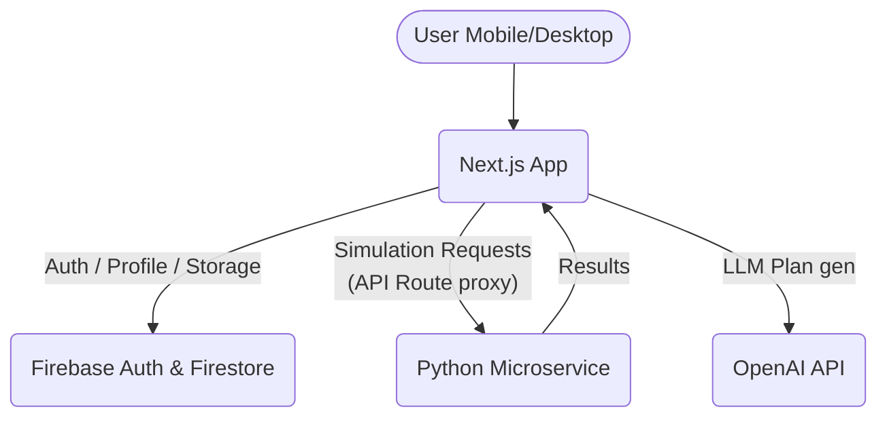

# Finéa Project Architecture

Finéa is a financial coaching application for students and young professionals. It consists of two main parts:
1. **Frontend / Core Backend**: Next.js 15+ (App Router)
2. **Simulation Microservice**: Python FastAPI

## System Context Diagram



## Tech Stack
### Next.js (Web App)
- **Language**: TypeScript (strict)
- **Framework**: Next.js 15+ (App Router)
- **Styling**: TailwindCSS
- **Components**: shadcn/ui, lucide-react
- **Validation**: Zod
- **Database / Auth**: Firebase SDK (Client for UI, Admin for Route Handlers)
- **Deployment**: Vercel

### Python Microservice (Simulations)
- **Language**: Python 3.10+
- **Framework**: FastAPI
- **Validation**: Pydantic
- **Purpose**: Run Monte Carlo simulations for the AI Copilot. (Source of truth for all mathematical projections)

## Directory Structure Strategy
We use a unified monorepo structure in the same repository for simplicity for this MVP.

```
/
├── apps/
│   ├── web/                (Next.js application, or we can just use the root for Next.js and put python in an app folder)
│   └── sim-service/        (Python FastAPI application)
├── README.md
├── ARCHITECTURE.md
└── CONTRIBUTING.md
```
*Note: To simplify the Vercel deploy, Next.js will be at the root of the repository, and the Python microservice will be inside `sim-service/` folder.*

```
/
├── app/                    (Next.js App Router)
├── components/             (React components: ui, layout, features)
├── lib/                    (Shared logic, Firebase instances, API clients, Zod schemas)
├── sim-service/            (Python FastAPI application)
│   ├── main.py
│   ├── models.py
│   ├── simulation.py
│   └── requirements.txt
├── README.md
├── ARCHITECTURE.md
└── CONTRIBUTING.md
```

## Data Access Pattern
- **Client Components**: Read from Firestore directly using Firebase Client SDK when realtime updates are needed, OR fetch from Next.js API APIs.
- **Server Components & API Routes**: Use Firebase Admin SDK. Only ONE instance of the Admin SDK should be initialized.
- **OpenAI**: Called via Next.js API Routes (Serverless) to protect API keys.
- **Python Service**: Called via Next.js API Routes. Next.js fetches aggregates from Firestore, anonymizes data, and passes the context to Python.
